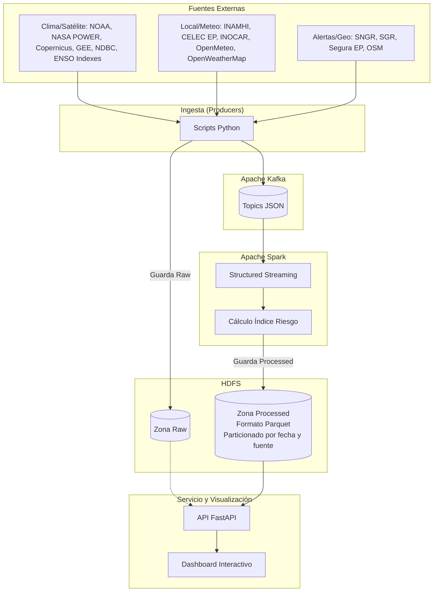

# Godzilla: Monitor de Riesgos a nivel Regional/Local


**Integrantes:** [Daniel Suárez](https://github.com/Dass-19) y [Magno Barco](https://github.com/Rask78EC)

Pipeline completo de datos (El Niño / Riesgo de inundación Guayaquil) utilizando contenedores para todo su ecosistema:
**Productores (Fuentes Externas) -> Kafka -> Spark Structured Streaming -> HDFS -> API (FastAPI) -> Dashboard Frontend**

## 🎯 Contexto y Objetivos Clave

Ante el fenómeno de El Niño y sus proyecciones de intensificación, este proyecto implementa una plataforma de **Big Data** para procesar masivamente información satelital y climática en tiempo cuasi-real, focalizándose en el riesgo hídrico para la ciudad de Guayaquil y la cuenca del río Guayas.

**Puntos Clave del Proyecto:**
- **Monitoreo Integral:** Evalúa la evolución de El Niño (NOAA, ENSO Indexes, boyas NDBC, NASA POWER, Copernicus) junto a variables locales críticas meteorológicas (INAMHI, Open Meteo, OpenWeatherMap), nivel de marea (INOCAR), operación del embalse Daule-Peripa (CELEC EP) e incidentes o alertas locales (SNGR, SGR, Segura EP).
- **Procesamiento Distribuido:** Ingesta robusta de datos vía **Apache Kafka** (1 topic por fuente) y transformación mediante **Apache Spark (Structured Streaming)** para calcular un índice de riesgo de inundación dinámico por zonas.
- **Almacenamiento Escalable:** Data Lake en **HDFS** particionado por fecha y fuente (Zonas Raw y Processed en formato Parquet).
- **Módulo de Vulnerabilidad (Dashboard Web):** 
  - Mapa interactivo de Guayaquil basado en OpenStreetMap (OSM).
  - Capas seleccionables: Topografía (procesada vía Google Earth Engine / DEM), redes hidrográficas, nivel de marea y acumulados de precipitación.
  - **Escenarios Combinados:** Permite modelar interactivamente el efecto de represamiento hídrico (Ej. coincidencia de lluvia intensa + marea alta que anula la descarga por gravedad).
- **Rutas de Evacuación Inteligentes:** Generación de rutas seguras sugeridas desde zonas de riesgo crítico hacia albergues y cotas altas utilizando motores de ruteo.

## 🏗️ Arquitectura y Estructura

El proyecto ha sido diseñado para correr enteramente bajo Docker Compose, orquestando el ciclo completo del pipeline Big Data: ingesta, procesamiento, almacenamiento y visualización.

### Diagrama de Arquitectura




### Estructura de Directorios

El repositorio se organiza dividiendo claramente las responsabilidades del sistema distribuido:

```text
Godzilla/
├── api/                           # API FastAPI que expone datos de HDFS (zona processed/raw) hacia frontend
├── backend/
│   ├── env/                       # Variables de entorno y credenciales (ej. Google Earth Engine)
│   ├── producers/                 # Scripts Python de ingesta hacia Kafka (INAMHI, NOAA, CELEC, SNGR, etc.)
│   └── spark/                     # PySpark (Structured Streaming) limpia y calcula el índice compuesto de riesgo
├── docker/                        # Dockerfiles e imágenes personalizadas (ej. clúster Hadoop/HDFS)
├── docs/                          # Diagramas de arquitectura y documentación técnica complementaria
├── frontend/                      # Dashboard web interactivo con mapas (Leaflet/Mapbox, capas de riesgo, simulación)
└── docker-compose.yml             # Orquestador principal unificado (Hadoop, Kafka, Spark, API, Productores)
```

### 🔐 Variables de Entorno y Credenciales

Para que los productores de datos funcionen correctamente, es necesario configurar las variables de entorno locales y proveer las credenciales de los servicios externos (por ejemplo, Google Earth Engine y OpenWeatherMap).

1. Navega a la carpeta de entornos: `cd backend/env/`
2. Copia el archivo de ejemplo para crear tu entorno local:
   ```bash
   cp .env.example .env
   ```
3. Edita el archivo `.env` resultante e inserta tus credenciales reales (por ejemplo, tu `OPENWEATHERMAP_API_KEY`).
4. **Google Earth Engine (GEE):** El proyecto requiere una cuenta de servicio de Google Cloud con la API de Earth Engine habilitada. Descarga la llave en formato JSON de tu cuenta de servicio y colócala en `backend/env/credentials.json`. Asegúrate de que el nombre de este archivo coincida con la ruta montada y declarada en la variable `GEE_CREDENTIALS_PATH` dentro de tu `.env`.

> **Nota:** El archivo `.env` y el JSON de credenciales de GEE deben mantenerse privados. El repositorio ya incluye una plantilla `.env.example` segura para guiarte.

## 🚀 Despliegue Rápido (Todo Dockerizado)

Todo el ecosistema (incluyendo Zookeeper, HDFS, Spark, Kafka, la API, el Frontend y la ingesta de los productores) vive dentro de una misma red (`enso_net`). 

Para iniciar el proyecto completo:

```bash
docker compose build
docker compose up -d
```

### ¿Qué sucede al ejecutar `docker compose up`?

1. Se inicializan **Hadoop** (NameNode, DataNode, ResourceManager) y **Kafka** (Zookeeper, Kafka broker).
2. Un contenedor de inicialización (`init-kafka`) crea automáticamente todos los tópicos requeridos (gee-data, alertas-sngr, noaa-data, etc.).
3. Los productores (contenedor `producers`) inician la extracción de fuentes de datos en tiempo real y publican los eventos en los tópicos de Kafka.
4. **Spark** (Master y Worker) se despliega, y el contenedor `spark-submitter` envía automáticamente el job de streaming, procesando la data de Kafka, calculando el índice de riesgo de inundación local, y guardando los resultados en formato Parquet dentro de HDFS.
5. La **API** se levanta y se conecta directamente a HDFS, exponiendo los resultados analizados.

## 📊 Visualización del Dashboard

Una vez levantado todo el entorno, el Dashboard web interactivo estará disponible de inmediato.
Abre tu navegador y dirígete a:

**[http://localhost:8000/dashboard/](http://localhost:8000/dashboard/)**

*(Nota: La raíz `http://localhost:8000/` está reservada para el backend. Asegúrate de incluir `/dashboard/` en la URL).*

### 🔗 Interfaces y Puertos Expuestos

| Servicio | URL / Puerto | Descripción |
|----------|--------------|-------------|
| **Dashboard y API FastAPI** | `http://localhost:8000` | Frontend web principal y backend API |
| **HDFS NameNode UI** | `http://localhost:9870` | Interfaz de administración de Hadoop/HDFS |
| **Spark Master UI** | `http://localhost:8080` | Monitoreo del clúster de Spark y jobs de streaming |
| **Kafka Broker Externo** | `localhost:9092` | Acceso a Kafka para consumo o depuración local |

## 📡 Endpoints Principales de la API

El frontend se alimenta de estos endpoints para mostrar el monitoreo en tiempo real:

- `GET /api/salud` - Endpoint básico para healthcheck y verificar el estado de la API (`{"estado": "ok"}`).
- `GET /api/riesgo/zonas` - Último índice de riesgo compuesto calculado para todas las zonas de Guayaquil.
- `GET /api/riesgo/zonas/{zona_id}/historico` - Serie de tiempo histórico del índice de riesgo de una zona específica.
- `GET /api/enso/estado` - Último estado ENSO (fase y anomalía SST) para el panel nacional/regional del dashboard.
- `GET /api/mareas/actual` - Altura de marea actual en el estuario (INOCAR).
- `GET /api/embalse/actual` - Nivel y caudal de descarga actual del embalse Daule-Peripa (CELEC).
- `GET /api/alertas/recientes` - Últimas alertas y reportes de afectaciones crudas provistas por la SNGR.
- `GET /api/escenario/simular?precip_24h_mm=X&altura_marea_m=Y&caudal_embalse_m3s=Z` - Recalcula interactivamente el riesgo para todas las zonas usando valores hipotéticos sin tocar HDFS.
- `GET /data/{filename}` - Capa de compatibilidad legacy para que el frontend lea archivos (JSON/GeoJSON) directamente de HDFS.
